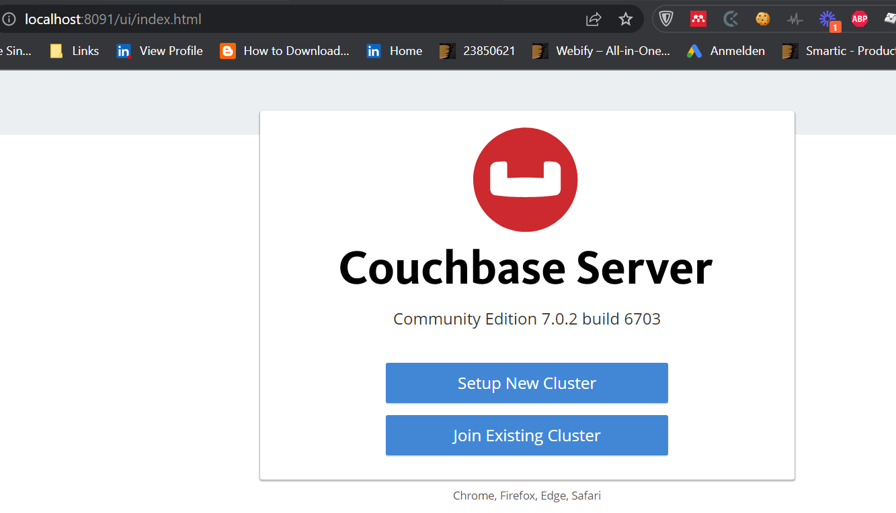

# Datenmanagement NoSQL Documentstore

## Implementierung

### Couchbase installieren

Um Couchbase schnell zu installieren verwenden wir folgenden Docker-Befehl:

```
docker run -itd --name couchbase-server -p 8091-8094:8091-8094 -p 11210:11210 couchbase:community
```

Damit wird das Docker-Image für couchbase-server community edition gepullt und anschließend ausgeführt. Wenn der Download abgeschlossen ist und die Couchbase-Instanz läuft können wir die Couchbase-Instanz konfigurieren, bevor wir zu der Implementierung erster CRUD-Befehle übergehen.
[1]

### Couchbase konfigurieren

Wenn wir nach Ausführung des Docker-Containers `localhost:8091` aufrufen, kommen wir zu folgender Couchbase-Setup-Seite:



Hier wählen wir "Setup New Cluster" und erstellen dann einen Admin-Nutzer (user: admin, pw: 2Ut@V2yw@NrN33t):


Damit kommen wir nun zum Couchbase-Dashboard, wo weitere Konfigurationen möglich sind:


Für Testzwecke erstellen wir hier gleich einen ersten Bucket mit dem Namen "einkaufsliste":


### ### Couchbase testen mit Python

Wir installieren nun die Python-Library für Couchbase.

```
python3 -m pip install couchbase
```

#### Verbindungsaufbau

In Python kann wie folgt eine Verbindung zu einem lokalen Couchbase Cluster aufgebaut werden:

```python
# get a reference to our cluster
cluster = Cluster('couchbase://localhost', ClusterOptions(
  PasswordAuthenticator('admin', '2Ut@V2yw@NrN33t')))

# get a reference to our bucket
cb = cluster.bucket('einkaufliste')
```

#### Create/Update Documents

Mit dem upsert-Command können Dokumente in einer collection erstellt werden (in diesem Fall die Default collection):

```python
cb_coll_default = cb.default_collection()
# Choosing other collections e.g.: cb.collection("other-collection-name")
# create a document in einkaufliste bucket
cb_coll_default.upsert("item-0001", {
    "title": "Birnen",
    "quantity": 3,
    "info": "Einzelne, lose Birnen",
    "type": "item"
})
...
```


### Read documents

```python
# get document by key
result = cb_coll_default.get("item-0001")
bananen = result.content_as[str]
print(bananen)
```


### Delete documents

```python
# delete document by key
cb_coll_default.remove("item-0002")
```


# 


[2]


### Quellen

[1] "https://docs.couchbase.com/tutorials/getting-started-ce/install-manage/tutorial_en.html"

[2] [Install and Start Using the Python SDK with Couchbase Server | Couchbase Docs](https://docs.couchbase.com/python-sdk/current/hello-world/start-using-sdk.html)
